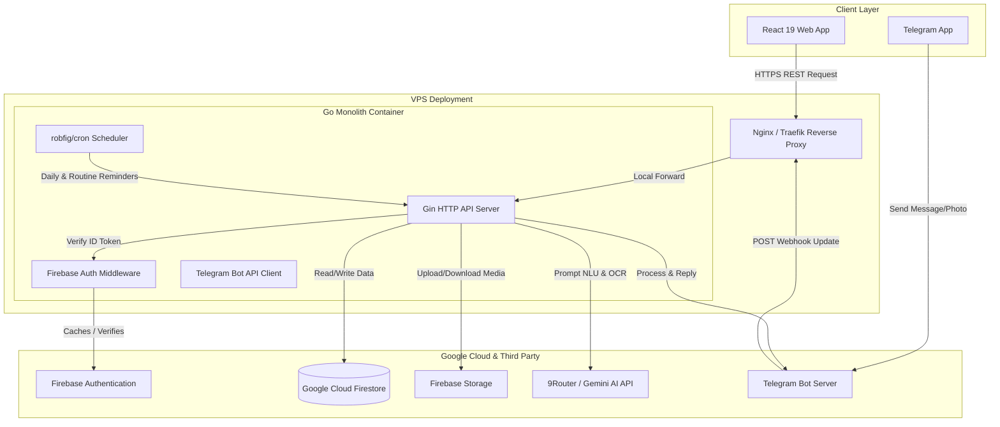

# Product Requirements Document (PRD)
## Backend Migration: Node.js to Go (Golang) — DompetCerdas

---

## 1. Executive Summary

### 1.1. Latar Belakang & Tujuan
**DompetCerdas** (saat ini versi `v2.8.17`) merupakan aplikasi manajemen keuangan pribadi yang dilengkapi dengan pemindaian struk berbasis AI dan integrasi Telegram Bot. Saat ini, seluruh logika backend berjalan di atas **Firebase Cloud Functions (Node.js 22 / TypeScript)** dengan database **Firestore**. 

Meskipun Firebase Functions mempermudah tahap awal pengembangan, arsitektur *serverless* berbasis Node.js ini menimbulkan tantangan berupa masalah *cold start* yang tinggi (terutama berdampak pada latensi bot Telegram), batasan *resource orchestration* untuk scheduled cron jobs, serta tingginya biaya eksekusi untuk operasi berkelanjutan.

Tujuan utama dari proyek ini adalah melakukan **rewrite total (porting) backend DompetCerdas dari Node.js/Firebase Functions ke Go (Golang)**. Backend baru ini akan dideploy sebagai satu service HTTP monolitik yang mandiri (self-hosted Go server) di dalam container Docker pada Virtual Private Server (VPS), dengan tetap mempertahankan Firestore sebagai database utama, Firebase Auth untuk autentikasi, serta Firebase Storage untuk penyimpanan media/struk.

### 1.2. Scope of Work (Dalam Lingkup)
- Porting seluruh HTTP endpoints, callable functions, dan background scheduled routines (cron) dari Firebase Functions ke Go.
- Pembuatan HTTP REST API Server berbasis framework **Gin** yang mengimplementasikan middleware autentikasi Firebase Token secara server-side.
- Porting Telegram Bot Webhook Handler ke Go menggunakan package `telegram-bot-api` untuk memproses interaksi chat, input suara, pemindaian struk, dan manajemen akun aktif Telegram.
- Integrasi Google Gemini AI menggunakan Go client REST API atau SDK resmi untuk kebutuhan STT (Speech-to-Text), receipt OCR parser, financial advisor (3 mode analisis), dan Natural Language Understanding (NLU).
- Porting scheduled cron job menggunakan library `robfig/cron/v3` di dalam proses Go server.
- Setup file konfigurasi `.env` terpusat dan mekanisme logging yang terstruktur (slog).
- Kontainerisasi backend menggunakan Docker dan penyiapan arsitektur deployment di VPS dengan reverse proxy (seperti Nginx atau Traefik).
- Penyusunan kebijakan CORS dan mekanisme integrasi bertahap (incremental migration) antara frontend yang tetap di Firebase Hosting dengan Go backend baru.

### 1.3. Non-Scope (Di Luar Lingkup)
- **Frontend Rewrite**: Kode frontend React 19 + TypeScript + Vite tidak diubah sama sekali (tetap berjalan seperti semula). Hanya endpoint URL target API di konfigurasi environment frontend yang dialihkan dari Firebase Functions ke Go server.
- **Database Migration**: Firestore tetap dipertahankan sebagai database utama. Skema database (koleksi dan dokumen) tidak diubah.
- **Storage & Auth Providers**: Firebase Authentication dan Firebase Storage tetap dipertahankan.
- **Frontend Hosting**: Web frontend tetap dideploy di Firebase Hosting.
- **Firestore Security Rules**: Aturan keamanan Firestore di server Firebase tidak diubah, kecuali jika ada penyesuaian khusus yang didelegasikan ke level API.

---

## 2. Motivasi & Latar Belakang

### 2.1. Masalah dengan Firebase Functions (Node.js)
1. **Cold Start & Latensi Bot**: Bot Telegram (@dompas_bot) membutuhkan respon cepat di bawah 2-3 detik. Sifat *serverless scale-to-zero* di Cloud Functions sering menyebabkan respon pertama bot tertunda hingga 5-8 detik saat instance mati.
2. **Keterbatasan CPU & Memori**: Operasi manipulasi file (seperti kompresi gambar menggunakan `sharp` sebelum diunggah ke Storage) dan integrasi pipeline AI membutuhkan manajemen resource memori dan performa konkurensi (goroutine) yang lebih efisien daripada model single-thread Node.js.
3. **Scheduled Jobs yang Tersebar**: Cloud Scheduler membutuhkan setup resource terpisah di Firebase Console dan memicu fungsi HTTP secara berkala. Ini menyulitkan debugging dan menambah kompleksitas resource cloud.
4. **Biaya Operasional**: Model penagihan per-eksekusi Firebase Functions membengkak seiring bertambahnya aktivitas bot Telegram yang melakukan pooling/webhook secara konstan serta antrean pemindaian struk.

### 2.2. Keuntungan Migrasi ke Go (Golang)
1. **Performa & Konsumsi Resource**: Go memiliki startup time instan (tanpa cold start) dan konsumsi memori yang sangat kecil (biasanya < 30MB untuk state idle), sehingga sangat efisien dijalankan di VPS murah.
2. **Konkurensi Native**: Fitur goroutine mempermudah pemrosesan webhook Telegram secara asinkron tanpa memblokir request HTTP utama.
3. **Pola Deployment Mandiri**: Menyatukan seluruh endpoints (callable, webhook, cron) ke dalam satu binary Go mempermudah observabilitas, log terpusat, dan integrasi CI/CD.
4. **Type-Safety yang Ketat**: Membantu memvalidasi payload Firestore dan data API Telegram secara presisi sejak kompilasi.

---

## 3. Arsitektur Target

### 3.1. Arsitektur Komponen Baru
Sistem baru akan beralih dari fungsi *serverless* modular yang terisolasi ke model **Modular Monolith + Vertical Slice** yang dideploy di dalam VPS.



### 3.2. Penjelasan Aliran Data & Integrasi
1. **Autentikasi (Firebase Auth)**: Web frontend melakukan login menggunakan Google Sign-In seperti biasa, mendapatkan **Firebase ID Token** (JWT), lalu mengirimkannya di HTTP Header: `Authorization: Bearer <ID_TOKEN>`. Go backend memvalidasi token tersebut menggunakan Firebase Admin Go SDK secara lokal (memanfaatkan public keys Firebase yang di-cache) untuk mengambil data `UID` dan `Email` user tanpa perlu melakukan network call ke Firebase setiap kali request masuk.
2. **Database (Firestore)**: Go backend menginisialisasi Firestore Client resmi dari Google Cloud. Seluruh transaksi database menggunakan context timeout yang ketat untuk menjamin *resilience*.
3. **Scheduled Jobs (Internal Cron)**: Library `robfig/cron/v3` diinisialisasi saat Go server mulai berjalan. Job ini berjalan di latar belakang (background goroutine) untuk mengevaluasi pengingat biaya rutin dan pengingat transaksi harian setiap jam.

---

## 4. Stack Teknologi Go

Developer disarankan menggunakan library-library standar industri berikut untuk porting kode:

| Kebutuhan | Nama Library / Package | Keterangan / Justifikasi |
|---|---|---|
| **HTTP Framework** | `github.com/gin-gonic/gin` | Cepat, memiliki middleware router yang matang, dan mudah disesuaikan dengan pola response API standar. |
| **Firestore SDK** | `cloud.google.com/go/firestore` | Client resmi Google Cloud untuk interaksi berkinerja tinggi dengan database Firestore. |
| **Firebase Admin SDK**| `firebase.google.com/go/v4` | Digunakan untuk verifikasi Firebase ID Token (`auth.Client`) secara lokal dan interaksi aman dengan Firebase Services. |
| **Gemini / AI Client**| `google.golang.org/genai` atau REST Client | REST client untuk interaksi dengan **9Router** API (`kang-coding` model) via endpoint OpenAI-compatible, serta SDK resmi untuk transfer audio (STT). |
| **Telegram Bot API** | `github.com/go-telegram-bot-api/telegram-bot-api/v5` | Library Go paling populer untuk integrasi Bot Telegram dengan dukungan penuh tipe webhook. |
| **Scheduled Tasks** | `github.com/robfig/cron/v3` | Scheduler cron in-app yang andal untuk menjalankan task rutin/harian dengan presisi per detik/menit. |
| **Environment Config**| `github.com/joho/godotenv` | Membaca file `.env` di lokal development dan memetakan ke struct config global. |
| **Excel Export** | `github.com/xuri/excelize/v2` | Library manipulasi file spreadsheet Excel (.xlsx) terbaik di Go untuk memporting fitur export laporan keuangan. |
| **Structured Logging**| `log/slog` (Standard Library Go 1.21+) | Logging terstruktur bawaan Go untuk mencatat event dan error dengan format JSON (mempermudah integrasi log analyzer). |

---

## 5. Struktur Direktori Go

Backend harus disusun mengikuti pola **Modular Monolith** dengan pendekatan **Vertical Slice** agar pemeliharaan per-domain bisnis (seperti transaksi, akun bersama, bot Telegram) terisolasi dengan baik.

```
dompet_cerdas_backend/
├── cmd/
│   └── api/
│       └── main.go                 # Entrypoint utama: inisialisasi DB, bot, cron, dan routing server
├── internal/
│   ├── config/
│   │   └── config.go               # Pemetaan environment variables ke struct Config & validasi startup
│   ├── middleware/
│   │   ├── auth.go                 # Middleware verifikasi Firebase ID Token (JWT)
│   │   ├── cors.go                 # Konfigurasi CORS (Cross-Origin Resource Sharing)
│   │   └── logger.go               # Middleware request/response logging menggunakan slog
│   ├── shared/
│   │   ├── db/
│   │   │   └── firestore.go        # Singleton inisialisasi Firestore Client
│   │   ├── response/
│   │   │   └── envelope.go         # Standard helper response format (success, error, meta)
│   │   └── ai/
│   │       └── ninerouter.go       # Client wrapper untuk 9Router (kang-coding)
│   └── modules/                    # VERTICAL SLICE DOMAIN
│       ├── telegram/
│       │   ├── handler.go          # Webhook handler (POST /api/v1/telegram/webhook)
│       │   ├── bot.go              # Router intent chat Telegram, parser teks, confirm/preview flow
│       │   ├── ocr.go              # Handler gambar struk -> local OCR + Gemini parser
│       │   ├── voice.go            # STT transkripsi audio voice note
│       │   └── repository.go       # Query data khusus untuk Telegram (balance check, category cache)
│       ├── account/
│       │   ├── handler.go          # Endpoint HTTP untuk create/share/delete account access
│       │   ├── service.go          # Logika copy data private ke shared workspace, generate/join invite code
│       │   └── model.go            # Struct representasi data Account, Workspace, Member, & Invite Code
│       ├── transaction/
│       │   ├── handler.go          # CRUD transaksi & refresh cache kategori via web
│       │   ├── service.go          # Logika bisnis kalkulasi & refresh category cache
│       │   └── model.go            # Struct data Transaction, Category, Budget, Plan, Debt
│       ├── advisor/
│       │   ├── handler.go          # Endpoint web AI analysis
│       │   ├── service.go          # Evaluasi data transaksi & format data input untuk Gemini
│       │   └── quota.go            # Rate limiter & quota tracker untuk Web AI Analysis
│       └── reminder/
│           ├── cron.go             # Registry job scheduler (hourly, daily)
│           ├── service.go          # Logika filter routine expense & user transaction status
│           └── notifier.go         # Pengiriman pesan pengingat ke Telegram
├── migrations/                     # Catatan skema manual atau init-seed script (jika ada)
├── .env.example
├── Dockerfile
├── docker-compose.yml
├── go.mod
└── go.sum
```

---

## 6. API Endpoint Mapping

Semua fungsi Firebase HTTPS callable (`onCall`) saat ini dimigrasikan ke endpoint **RESTful API** dengan autentikasi menggunakan Firebase ID Token. Response harus dibungkus menggunakan **envelope JSON standar** sesuai dengan pedoman `api-design` skill.

### 6.1. Ringkasan Perbandingan Endpoint
| Firebase Function Name | HTTP Method | Target REST API Path | Deskripsi & Auth Requirement |
|---|---|---|---|
| `telegramWebhook` | `POST` | `/api/v1/telegram/webhook` | Webhook dari Telegram API (Public, No Auth) |
| `healthCheck` | `GET` | `/api/v1/health` | Health Check server & DB status (Public) |
| `linkTelegram` | `POST` | `/api/v1/telegram/link` | Memvalidasi token link & menyambungkan akun (Auth Required) |
| `notifyLinkSuccess` | `POST` | `/api/v1/telegram/notify-success` | Mengirim pesan konfirmasi sukses link ke Telegram (Auth Required) |
| `refreshCategoryCache` | `POST` | `/api/v1/categories/refresh-cache` | Memaksa pembaruan cache kategori user (Auth Required) |
| `analyzeFinancialData` | `POST` | `/api/v1/advisor/analyze` | Web AI analysis (HEALTH, SPENDING, SAVINGS) (Auth Required) |
| `createSharedAccount` | `POST` | `/api/v1/shared-accounts` | Membuat akun bersama baru (Auth Required) |
| `shareExistingAccount` | `POST` | `/api/v1/shared-accounts/convert` | Mengonversi akun private ke akun bersama (Auth Required) |
| `deleteSharedAccountAccess`| `DELETE` | `/api/v1/shared-accounts/:id/access`| Menghapus workspace atau keluar sebagai anggota (Auth Required) |
| `createSharedInviteCode` | `POST` | `/api/v1/shared-accounts/:id/invite-code`| Generate 7-day invite code (Auth Required) |
| `joinSharedAccountByCode` | `POST` | `/api/v1/shared-accounts/join` | Gabung ke akun bersama menggunakan invite code (Auth Required) |
| `scanReceipt` | `POST` | `/api/v1/transactions/scan-receipt` | OCR pemindaian struk base64 di web (Auth Required) |

---

### 6.2. Detail Spesifikasi REST API & Schema Payload

#### 1. POST /api/v1/telegram/webhook
- **Deskripsi**: Webhook penerima pesan dari Telegram Bot API.
- **Authentication**: None (Public). Harus divalidasi bahwa request benar-benar berasal dari rentang IP Telegram (opsional) atau menyertakan secret token Telegram Bot di query parameter `/webhook?token=<SECRET_TOKEN>`.
- **Payload Request**: JSON payload sesuai tipe `Update` Telegram.
- **Response**: `200 OK` (dengan string `"OK"` untuk mencegah retry dari Telegram server).

#### 2. POST /api/v1/telegram/link
- **Deskripsi**: Menghubungkan akun Telegram user ke akun Firebase UID yang sedang login di web.
- **Authentication**: Bearer Token (Firebase Auth).
- **Request Body**:
  ```json
  {
    "token": "a1b2c3d4e5f6g7h8i9j0k1l2m3n4o5p6"
  }
  ```
- **Response (200 OK)**:
  ```json
  {
    "success": true,
    "message": "Akun Telegram berhasil terhubung",
    "data": {
      "telegramId": 123456789,
      "accountId": "acc_main_987",
      "accountName": "Tabungan Utama"
    }
  }
  ```

#### 3. POST /api/v1/advisor/analyze
- **Deskripsi**: Menjalankan analisis keuangan dengan AI Gemini berdasarkan data historis transaksi user.
- **Authentication**: Bearer Token (Firebase Auth).
- **Request Body**:
  ```json
  {
    "mode": "SPENDING"
  }
  ```
- **Response (200 OK)**:
  ```json
  {
    "success": true,
    "message": "Analisis pengeluaran berhasil dibuat",
    "data": {
      "mode": "SPENDING",
      "markdown": "## Ringkasan Pola Pengeluaran\nBerdasarkan data Anda...",
      "summary": {
        "totalTransactions": 142,
        "totalTransactionsAnalyzed": 50,
        "analyzedDateRange": { "start": "2026-07-01", "end": "2026-07-30" },
        "incomeTotal": 15000000,
        "expenseTotal": 8500000,
        "netBalance": 6500000,
        "topCategories": [
          { "name": "Makanan", "total": 3500000, "count": 25, "percentage": 41.1 }
        ]
      }
    }
  }
  ```

---

## 7. Domain Model (Go Structs)

Berikut adalah translasi dari TypeScript interfaces yang ada ke Go Structs dengan tag Firestore (`firestore`) dan JSON (`json`).

### 7.1. Telegram Link (`telegram_link/main`)
```go
package model

import "time"

type TelegramLink struct {
	TelegramID        int64     `firestore:"telegramId" json:"telegram_id"`
	Username          string    `firestore:"username,omitempty" json:"username,omitempty"`
	FirstName         string    `firestore:"firstName" json:"first_name"`
	LastName          string    `firestore:"lastName,omitempty" json:"last_name,omitempty"`
	DefaultAccountID  string    `firestore:"defaultAccountId,omitempty" json:"default_account_id,omitempty"`
	LinkedAt          time.Time `firestore:"linkedAt" json:"linked_at"`
	Active            bool      `firestore:"active" json:"active"`
	LastInteraction   time.Time `firestore:"lastInteraction" json:"last_interaction"`
	ReminderEnabled   bool      `firestore:"reminderEnabled,omitempty" json:"reminder_enabled,omitempty"`
	ReminderTime      string    `firestore:"reminderTime,omitempty" json:"reminder_time,omitempty"` // format "HH:MM"
}
```

### 7.2. Link Token (`link_tokens/{token}`)
```go
package model

import "time"

type LinkToken struct {
	Token             string    `firestore:"token" json:"token"`
	TelegramID        int64     `firestore:"telegramId" json:"telegram_id"`
	TelegramUsername  string    `firestore:"telegramUsername,omitempty" json:"telegram_username,omitempty"`
	TelegramFirstName string    `firestore:"telegramFirstName,omitempty" json:"telegram_first_name,omitempty"`
	TelegramLastName  string    `firestore:"telegramLastName,omitempty" json:"telegram_last_name,omitempty"`
	CreatedAt         time.Time `firestore:"createdAt" json:"created_at"`
	ExpiresAt         time.Time `firestore:"expiresAt" json:"expires_at"`
	Used              bool      `firestore:"used" json:"used"`
	UsedAt            time.Time `firestore:"usedAt,omitempty" json:"used_at,omitempty"`
}
```

### 7.3. Shared Account & Members
```go
package model

import "time"

type SharedAccount struct {
	Name                 string    `firestore:"name" json:"name"`
	OwnerUserID          string    `firestore:"ownerUserId" json:"owner_user_id"`
	InviteCode           *string   `firestore:"inviteCode" json:"invite_code"`
	InviteCodeExpiresAt  *time.Time `firestore:"inviteCodeExpiresAt" json:"invite_code_expires_at"`
	CreatedAt            time.Time `firestore:"createdAt" json:"created_at"`
	UpdatedAt            time.Time `firestore:"updatedAt" json:"updated_at"`
}

type SharedMember struct {
	UserID      string    `firestore:"userId" json:"user_id"`
	Role        string    `firestore:"role" json:"role"` // OWNER atau MEMBER
	Email       *string   `firestore:"email" json:"email"`
	DisplayName *string   `firestore:"displayName" json:"display_name"`
	JoinedAt    time.Time `firestore:"joinedAt" json:"joined_at"`
	UpdatedAt   time.Time `firestore:"updatedAt" json:"updated_at"`
}
```

### 7.4. Transaction Document
```go
package model

import "time"

type Transaction struct {
	ID              string    `firestore:"-" json:"id"`
	Amount          float64   `firestore:"amount" json:"amount"`
	Date            string    `firestore:"date" json:"date"` // format "YYYY-MM-DD"
	Description     string    `firestore:"description,omitempty" json:"description,omitempty"`
	CategoryID      string    `firestore:"categoryId" json:"category_id"`
	CreatedByUserID string    `firestore:"createdByUserId" json:"created_by_user_id"`
	UpdatedByUserID string    `firestore:"updatedByUserId,omitempty" json:"updated_by_user_id,omitempty"`
	CreatedAt       time.Time `firestore:"createdAt" json:"created_at"`
	UpdatedAt       time.Time `firestore:"updatedAt" json:"updated_at"`
}
```

---

## 8. Business Logic Requirements & Porting Rules

### 8.1. Telegram Idempotency (Duplikasi Request)
Telegram Bot API melakukan retry otomatis jika webhook tidak mengembalikan response `200 OK` dalam 5 detik. 
- **Aturan**: Setiap request webhook masuk wajib diperiksa `update_id`-nya di Firestore koleksi `telegram_processed_updates`.
- **Implementasi di Go**:
  Gunakan transaksi atomik atau metode `Create` dokumen (write-if-not-exists) pada Firestore. Jika dokumen dengan ID `update_id` sudah ada, return `200 OK` secara langsung dan hentikan proses untuk menghindari pemrosesan ganda (terutama saat memanggil LLM Gemini yang berbayar).

### 8.2. Keamanan Link Token Telegram
Untuk menyambungkan Telegram ke akun web app:
- Token berupa string acak cryptographically secure sepanjang 32 karakter.
- Expiry date diatur **5 menit** dari pembuatan.
- Harus bersifat **sekali pakai (one-time use)**. Setelah divalidasi, tandai `used = true` dan `usedAt = serverTimestamp()`.
- Di Go, buat background goroutine berkala (atau manfaatkan cron harian) untuk menghapus token yang expired (berumur > 1 jam) guna menghemat penyimpanan Firestore.

### 8.3. Rate Limiting Telegram
Mencegah spam ke server API:
- **Unggah Foto/Struk**: Maksimal 20 kali per hari, dan 5 kali per jam per user Telegram.
- **Pesan Chat Biasa**: Maksimal 10 pesan per menit per user Telegram.
- **Implementasi**: Catat rate limit di koleksi `telegram_rate_limits/{telegramId}` menggunakan struktur data sliding window atau bucket token di memory cache (Redis/Local Cache) dengan fallback persisten ke Firestore jika terjadi restart server.

### 8.4. Web AI Quota & Cooldown
Fitur analisis keuangan web memiliki pembatasan ketat untuk menekan biaya API Gemini:
- **Cooldown**: Minimal jarak antar request analisis dari user yang sama adalah 20 detik.
- **Limit Harian**: Maksimal 12 request per hari per user.
- **Limit Token**: Maksimal 30.000 token per hari per user.
- **Logika Go**: Setiap kali request `analyzeFinancialData` masuk, query dokumen `web_ai_limits/{userId}`. Validasi `lastRequestedAt`, `dailyCount`, dan `dailyTokensUsed`. Update nilai tersebut setelah response Gemini didapatkan dengan membaca jumlah token aktual dari metadata response Gemini.

### 8.5. Validasi Hak Akses Akun Bersama (Workspace Authorization)
Untuk modifikasi data pada `sharedAccounts/{sharedAccountId}`:
- **Owner**: Memiliki hak penuh untuk menambah, mengedit, dan menghapus data transaksi/kategori dari anggota manapun. Owner dapat menghapus workspace dengan syarat dia adalah satu-satunya anggota yang tersisa.
- **Member**: Hanya diizinkan untuk mengedit atau menghapus record data yang dibuat oleh dirinya sendiri (`createdByUserId == currentUserId`). Member dapat keluar dari workspace secara mandiri kapan saja.
- **Aturan Implementasi**: Go API Middleware/Service wajib memuat query pengecekan peran (role) user di sub-koleksi `/members/{userId}` sebelum melakukan mutasi data di database.

---

## 9. Deployment Architecture

Backend baru akan dideploy secara mandiri di Virtual Private Server (VPS).

```
+-------------------------------------------------------------------+
|                            VPS Host                               |
|                                                                   |
|   +-----------------------+       +---------------------------+   |
|   |   Nginx / Traefik     |       |    Go Backend Container   |   |
|   |                       |       |                           |   |
|   |   - SSL Termination   | ----> |   - REST API (Port 8080)  |   |
|   |   - Request Forward   |       |   - Internal Cron Worker  |   |
|   |   - Static Assets     |       |   - Bot Webhook Route     |   |
|   +-----------------------+       +---------------------------+   |
|               |                                                   |
+---------------|---------------------------------------------------+
                |
                v (HTTPS to External API)
      [ Google Firestore & Gemini AI ]
```

### 9.1. Dockerization
Contoh setup `Dockerfile` multi-stage build untuk menghasilkan image minimal (< 50MB):

```dockerfile
# Stage 1: Build
FROM golang:1.22-alpine AS builder
WORKDIR /app
COPY go.mod go.sum ./
RUN go mod download
COPY . .
RUN CGO_ENABLED=0 GOOS=linux go build -ldflags="-w -s" -o dompet_cerdas_api cmd/api/main.go

# Stage 2: Run
FROM alpine:3.19
RUN apk --no-cache add ca-certificates tzdata
WORKDIR /app
COPY --from=builder /app/dompet_cerdas_api .
COPY --from=builder /app/.env.example .env

EXPOSE 8080
CMD ["./dompet_cerdas_api"]
```

### 9.2. Docker Compose
File `docker-compose.yml` untuk mempermudah orkestrasi service local/production:

```yaml
version: '3.8'

services:
  app:
    build: .
    ports:
      - "8080:8080"
    environment:
      - TZ=Asia/Jakarta
    env_file:
      - .env
    restart: always
```

### 9.3. Daftar Environment Variables (.env)
```env
# Server Configuration
PORT=8080
ENV=production
CORS_ALLOWED_ORIGINS=https://dompetcerdas.web.app,https://dompetcerdas.firebaseapp.com

# Firebase SDK Credentials
# Path menuju file json service account google cloud
GOOGLE_APPLICATION_CREDENTIALS=/app/service-account.json
FIREBASE_PROJECT_ID=dompetcerdas-xxxx

# Telegram Bot API Configuration
TELEGRAM_BOT_TOKEN=123456789:ABCdefGhIJKlmNoPQRsTUVwxyZ
TELEGRAM_WEBHOOK_URL=https://api.dompetcerdas.com/api/v1/telegram/webhook

# AI Configuration (9Router)
NINEROUTER_API_KEY=nr-xxxxxx
NINEROUTER_BASE_URL=https://9r.indoomega.my.id/v1
GEMINI_API_KEY=ai-xxxxxx # Untuk library audio SDK asli jika diperlukan
```

---

## 10. Kode Snippet Kritis (Go)

### 10.1. Firebase Auth Middleware
Middleware untuk memeriksa dan memvalidasi token otorisasi dari client web.

```go
package middleware

import (
	"context"
	"net/http"
	"strings"

	firebase "firebase.google.com/go/v4"
	"github.com/gin-gonic/gin"
)

func FirebaseAuth(app *firebase.App) gin.HandlerFunc {
	return func(c *gin.Context) {
		authHeader := c.GetHeader("Authorization")
		if authHeader == "" {
			c.JSON(http.StatusUnauthorized, gin.H{
				"success": false,
				"message": "Header otorisasi diperlukan",
				"error":   gin.H{"code": "UNAUTHORIZED"},
			})
			c.Abort()
			return
		}

		parts := strings.Split(authHeader, " ")
		if len(parts) != 2 || parts[0] != "Bearer" {
			c.JSON(http.StatusUnauthorized, gin.H{
				"success": false,
				"message": "Format token otorisasi tidak valid",
				"error":   gin.H{"code": "INVALID_TOKEN_FORMAT"},
			})
			c.Abort()
			return
		}

		idToken := parts[1]
		client, err := app.Auth(context.Background())
		if err != nil {
			c.JSON(http.StatusInternalServerError, gin.H{
				"success": false,
				"message": "Gagal menginisialisasi modul autentikasi",
				"error":   gin.H{"code": "AUTH_INIT_ERROR"},
			})
			c.Abort()
			return
		}

		token, err := client.VerifyIDToken(context.Background(), idToken)
		if err != nil {
			c.JSON(http.StatusUnauthorized, gin.H{
				"success": false,
				"message": "Token tidak valid atau kedaluwarsa",
				"error":   gin.H{"code": "INVALID_OR_EXPIRED_TOKEN"},
			})
			c.Abort()
			return
		}

		// Simpan UID dan klaim token ke context Gin
		c.Set("userId", token.UID)
		c.Set("userEmail", token.Claims["email"])
		c.Next()
	}
}
```

### 10.2. Telegram Webhook Handler & Idempotency
Logika krusial untuk mencegah pemrosesan webhook ganda.

```go
package telegram

import (
	"context"
	"net/http"
	"strconv"
	"time"

	"cloud.google.com/go/firestore"
	"github.com/gin-gonic/gin"
	"google.golang.org/grpc/codes"
	"google.golang.org/grpc/status"
)

type WebhookHandler struct {
	FirestoreClient *firestore.Client
}

func (h *WebhookHandler) HandleUpdate(c *gin.Context) {
	var update map[string]interface{}
	if err := c.ShouldBindJSON(&update); err != nil {
		c.JSON(http.StatusBadRequest, gin.H{"error": "Payload tidak valid"})
		return
	}

	updateIDVal, exists := update["update_id"]
	if !exists {
		c.JSON(http.StatusBadRequest, gin.H{"error": "update_id tidak ditemukan"})
		return
	}

	var updateID int64
	switch v := updateIDVal.(type) {
	case float64:
		updateID = int64(v)
	case int64:
		updateID = v
	}

	updateIDStr := strconv.FormatInt(updateID, 10)
	ctx := context.Background()
	docRef := h.FirestoreClient.Collection("telegram_processed_updates").Doc(updateIDStr)

	// Idempotency check menggunakan Firestore Create
	_, err := docRef.Create(ctx, map[string]interface{}{
		"updateId":  updateID,
		"status":    "processing",
		"createdAt": time.Now(),
	})

	if err != nil {
		// Jika dokumen sudah ada, abaikan request (duplicate)
		if status.Code(err) == codes.AlreadyExists {
			c.String(http.StatusOK, "OK")
			return
		}
		c.JSON(http.StatusInternalServerError, gin.H{"error": "Gagal memproses kunci idempotensi"})
		return
	}

	// Menjalankan business logic bot secara asinkron agar webhook langsung merespon cepat ke Telegram
	go func(up map[string]interface{}) {
		err := processBotLogic(up)
		statusStr := "processed"
		errorMsg := ""
		if err != nil {
			statusStr = "failed"
			errorMsg = err.Error()
		}

		_, _ = docRef.Set(ctx, map[string]interface{}{
			"status":      statusStr,
			"processedAt": time.Now(),
			"error":       errorMsg,
		}, firestore.MergeAll)
	}(update)

	c.String(http.StatusOK, "OK")
}

func processBotLogic(update map[string]interface{}) error {
	// Letakkan perutean bot dan integrasi Gemini di sini
	time.Sleep(500 * time.Millisecond) // Simulasi kerja
	return nil
}
```

---

## 11. Strategi Migrasi (Incremental Migration)

Migrasi backend harus dilakukan secara bertahap tanpa merusak pengalaman pengguna di aplikasi web yang sedang aktif.

```
Fase Awal:
[Web Frontend] ---> Panggil HTTP Callable ---> [Firebase Functions]

Fase Transisi (Dual Route):
                        +---> API Lama (HTTPS Callable) ---> [Firebase Functions]
                        |
[Web Frontend] (Dynamic) +
                        |
                        +---> API Baru (REST API) ---------> [Go Backend VPS]

Fase Akhir:
[Web Frontend] ---> REST API Baru (REST API) ---------> [Go Backend VPS]
```

### 11.1. Konfigurasi Endpoint Dinamis di Frontend
Untuk mendukung pengalihan bertahap, frontend React harus menggunakan wrapper HTTP service yang mengenali jenis migrasi endpoint:
1. Ganti pemanggilan SDK `httpsCallable` Firebase secara dinamis.
2. Endpoint yang sudah lulus uji coba di Go diarahkan menggunakan `fetch()` standar ke `https://api.dompetcerdas.com/api/v1/...` dengan menyertakan header `Authorization: Bearer <token>`.
3. Endpoint yang belum siap di-porting tetap menggunakan SDK `onCall` lama.

### 11.2. Penanganan CORS (Cross-Origin Resource Sharing)
Karena frontend dihosting di domain Firebase (`*.web.app` / `*.firebaseapp.com`) dan backend berjalan di VPS mandiri, Go server wajib mengaktifkan middleware CORS dengan aturan:
- Mengizinkan origin spesifik yang terdaftar di `.env` (misal: `CORS_ALLOWED_ORIGINS`).
- Mengizinkan header: `Content-Type`, `Authorization`.
- Mengizinkan metode: `GET`, `POST`, `PUT`, `DELETE`, `OPTIONS`.

---

## 12. Definition of Done (DoD) per Fase

Kriteria selesai yang harus dipenuhi sebelum melangkah ke fase berikutnya:

### Fase 1: Setup Proyek & Autentikasi
- [ ] Boilerplate Go monolitik terbentuk sesuai struktur direktori di atas.
- [ ] Firebase SDK terintegrasi dan Auth Middleware berhasil memvalidasi token.
- [ ] Health check endpoint `/api/v1/health` mengembalikan status database Firestore terkini.

### Fase 2: Porting Fitur Akun Bersama & Kolaborasi
- [ ] Implementasi logic `createSharedAccount` dan `shareExistingAccount`.
- [ ] Flow join account menggunakan token invite code berjalan dengan benar.
- [ ] Seluruh unit test untuk pemeriksaan hak akses (owner vs member) pada workspace bersama lolos verifikasi.

### Fase 3: Bot Telegram & Integrasi AI (Webhook)
- [ ] Webhook bot Telegram berhasil di-porting ke Go dengan proteksi idempotency update.
- [ ] Flow parser transaksi hybrid (NLU + Regex) dan konfirmasi transaksi berfungsi normal.
- [ ] Pemindaian struk melalui gambar (OCR + Gemini) berhasil mengembalikan format transaksi final.
- [ ] Transkripsi file suara (STT) bot Telegram berjalan lancar.

### Fase 4: Web AI Advisor & Cron Job
- [ ] Fitur Web AI Analysis berfungsi penuh dengan validasi quota, cooldown, dan token rate limit.
- [ ] System cron internal berhasil memicu routine reminder dan daily reminder ke pengguna Telegram yang aktif sesuai jam preferensi mereka.

---

## 13. Risiko & Mitigasi

| Identifikasi Risiko | Potensi Dampak | Rencana Mitigasi |
|---|---|---|
| **Peningkatan Latensi Pembacaan Firestore** | API Go menjadi lambat dan bot Telegram timeout. | Pastikan client Firestore menggunakan koneksi pool dan manfaatkan goroutine asinkron untuk operasi tulis non-blocking (seperti log audit atau update status). |
| **Keterbatasan Token Gemini API (Rate Limit 429)** | Fitur OCR struk dan NLU bot gagal mendadak. | Terapkan mekanisme retry dengan exponential backoff pada client `9Router`, serta fallback default kategori ke "Belanja" jika API mengalami timeout atau gagal total. |
| **Kegagalan Verifikasi JWT di VPS** | Pengguna web tidak bisa mengakses data (Error 401). | Implementasikan cache public keys dari Firebase Auth server secara in-memory (diperbarui berkala setiap 24 jam) sehingga tidak perlu melakukan network call eksternal setiap kali memverifikasi request token. |
| **Pembersihan Log yang Kurang Terstruktur** | Disk VPS penuh akibat log dump dari goroutine yang bocor. | Gunakan log rotation pada container Docker dan atur format output menggunakan `slog` dengan level `INFO` pada server produksi. |

---

## 14. Out of Scope (TIDAK Direwrite)
1. **Aturan Database Firestore**: Rule bawaan di Firestore Console (`firestore.rules`) tidak disentuh.
2. **Pola Transaksi Frontend**: UI visual dari menu transaksi, budget tracker, hutang-piutang, dan dashboard analitik di web tetap sama.
3. **Penyimpanan Cloud Storage**: Lokasi dan struktur folder upload file struk tidak mengalami perubahan.
